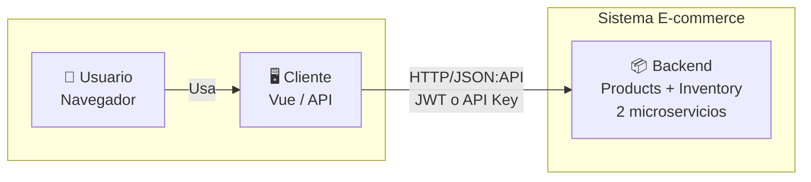
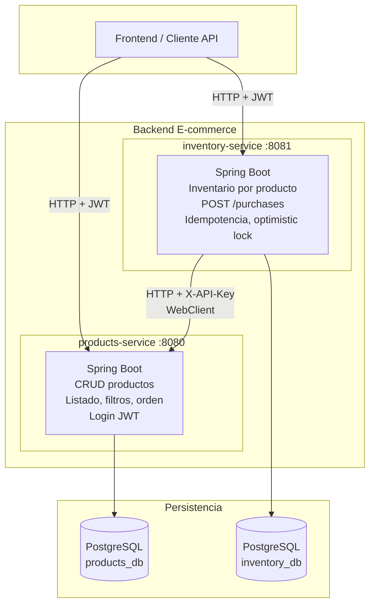
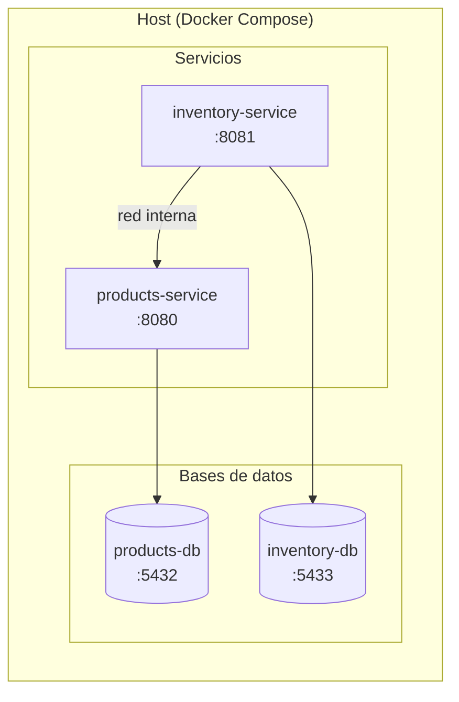

# Diagramas C4 – Arquitectura E-commerce

Modelo [C4](https://c4model.com/): **Contexto** (nivel 1) y **Contenedores** (nivel 2). Los diagramas en Mermaid se renderizan en GitHub, GitLab y editores con soporte Markdown.

---

## Nivel 1: Contexto del sistema

Quién usa el sistema y qué sistema externo existe (el backend de la prueba).

- **Usuario**: persona que usa la aplicación (navegador).
- **Cliente**: frontend Vue o cualquier consumidor de la API (Postman, integraciones).
- **Sistema E-commerce**: el backend de la prueba; no hay API Gateway; cada microservicio se expone por su puerto (8080, 8081).

---

## Nivel 2: Contenedores (microservicios)

Contenedores de aplicación y bases de datos.

| Contenedor | Tecnología | Responsabilidad |
|------------|------------|-----------------|
| **products-service** | Spring Boot, :8080 | Catálogo (CRUD), listado con paginación/filtros/orden, login y emisión de JWT. Acepta API Key (servicios) o JWT (frontend). |
| **inventory-service** | Spring Boot, :8081 | Inventario por producto, compras (POST /purchases) con idempotencia (`Idempotency-Key`) y control optimista. Llama a products-service para validar productos. |
| **products_db** | PostgreSQL | Datos de productos. |
| **inventory_db** | PostgreSQL | Inventario y compras. |

### Flujos principales

1. **Frontend → Products**: `GET/POST/PATCH/DELETE /api/products`, `POST /auth/login` (JWT).
2. **Frontend → Inventory**: `GET/PUT /api/inventory/{id}`, `POST /api/purchases` (JWT).
3. **Inventory → Products**: llamadas HTTP con header `X-API-Key` (WebClient + Resilience4j) para validar que el producto exista.

---

## Vista de despliegue (Docker)

Misma arquitectura en contexto de despliegue con Docker Compose.

- En desarrollo/producción cada servicio puede ir en su propio contenedor o nodo; Inventory necesita conectividad a Products (por nombre de servicio o URL configurable).

---

## Resumen

| Nivel C4 | Contenido |
|----------|-----------|
| **1 – Contexto** | Usuario y cliente (Vue/API) consumen el sistema E-commerce (backend). |
| **2 – Contenedores** | products-service, inventory-service y sus bases PostgreSQL; comunicación HTTP (JWT/API Key) y entre servicios (WebClient + API Key). |

Documentación de la API: Swagger UI en cada servicio (`/swagger-ui.html`). Diagramas UML: [DIAGRAMAS_UML.md](DIAGRAMAS_UML.md).
