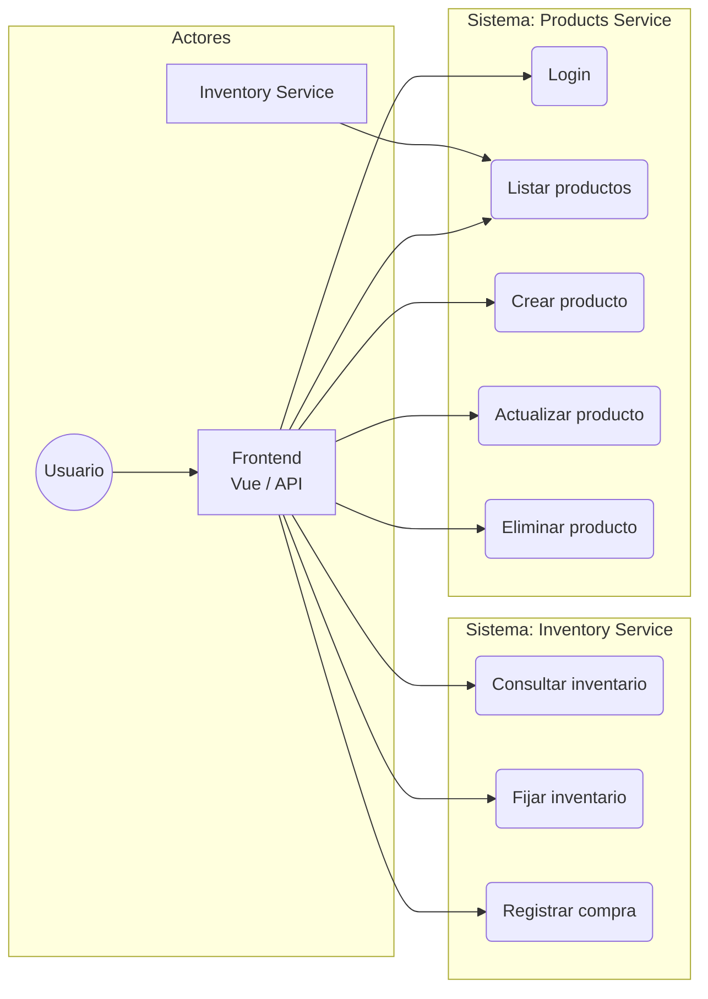
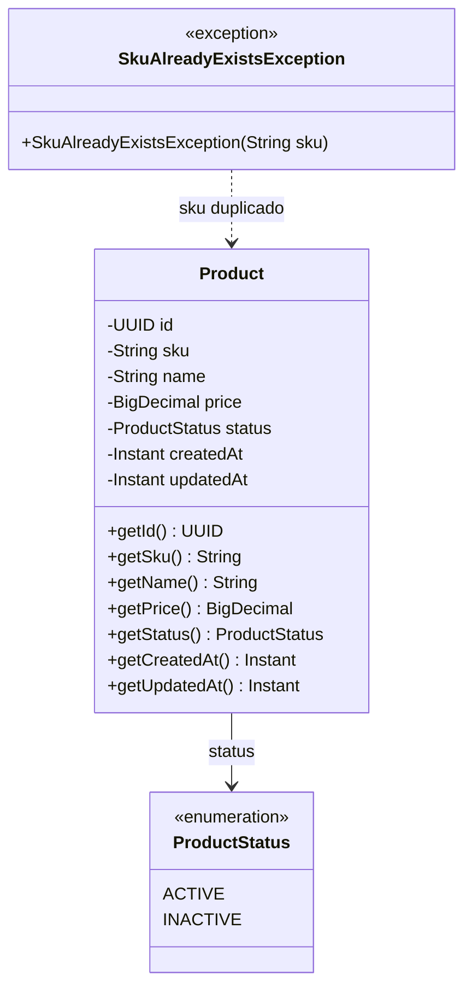
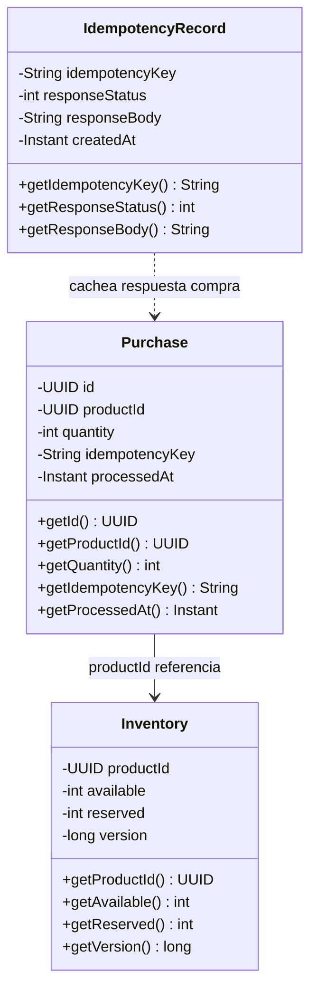
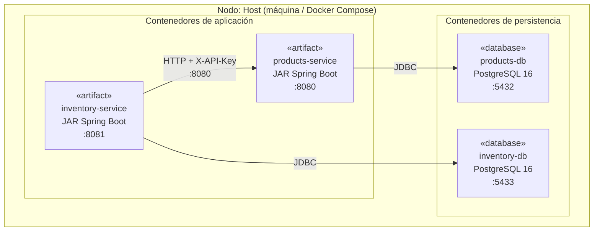
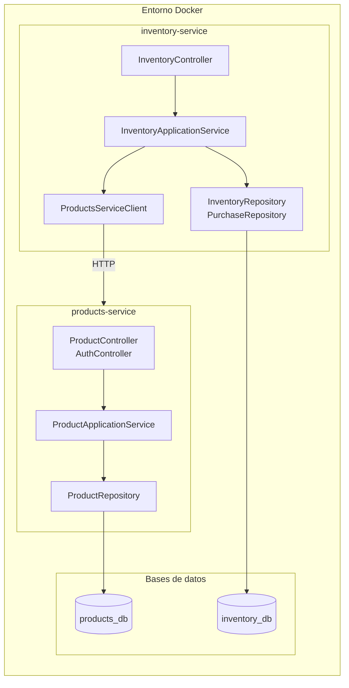
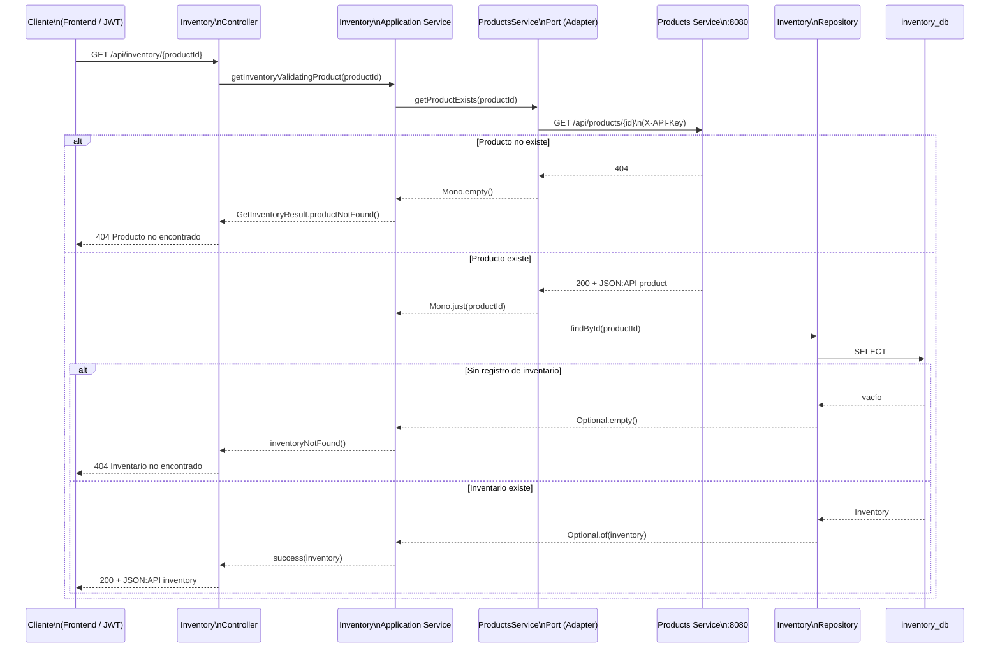
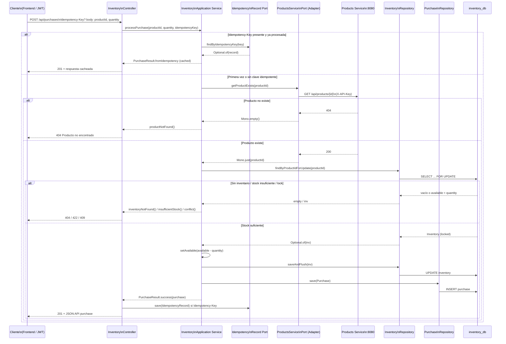

# Diagramas UML – E-commerce Backend

Diagramas en **Mermaid** (render en GitHub, GitLab y editores Markdown): casos de uso, clases de dominio y despliegue.

---

## 1. Diagrama de casos de uso

Actores y casos de uso del sistema (backend). El **Usuario** actúa a través del **Frontend**; el **Inventory Service** es actor secundario que consume el Products Service.

| Actor | Descripción |
|-------|-------------|
| **Usuario** | Persona que usa la aplicación. |
| **Frontend** | Cliente (Vue, Postman, etc.) que consume la API con JWT. |
| **Inventory Service** | Microservicio que consulta productos (p. ej. validar que existan). |

| Caso de uso | Servicio | Endpoint / descripción |
|-------------|----------|------------------------|
| Login | Products | `POST /auth/login` → JWT |
| Listar productos | Products | `GET /api/products` (paginación, filtros, orden) |
| Crear producto | Products | `POST /api/products` |
| Actualizar producto | Products | `PATCH /api/products/{id}` |
| Eliminar producto | Products | `DELETE /api/products/{id}` |
| Consultar inventario | Inventory | `GET /api/inventory/{productId}` |
| Fijar inventario | Inventory | `PUT /api/inventory/{productId}` |
| Registrar compra | Inventory | `POST /api/purchases` (idempotente con `Idempotency-Key`) |

---

## 2. Diagrama de clases (dominio)

Entidades y enums del dominio de ambos microservicios. Relaciones entre sí y con excepciones de dominio.

### 2.1 Products Service (dominio)

### 2.2 Inventory Service (dominio)

- **Inventory**: identificado por `productId` (PK); `version` para control optimista.
- **Purchase**: registro de compra; `idempotencyKey` para idempotencia.
- **IdempotencyRecord**: guarda la respuesta de una compra ya procesada para repetir la misma petición sin efecto.

---

## 3. Diagrama de despliegue

Nodos de ejecución, artefactos y conexiones en un despliegue tipo Docker Compose.

### Vista de componentes en nodo (despliegue simplificado)

| Elemento | Tipo | Descripción |
|----------|------|-------------|
| **products-service** | Contenedor / artefacto | JAR Spring Boot, puerto 8080. |
| **inventory-service** | Contenedor / artefacto | JAR Spring Boot, puerto 8081. |
| **products-db** | Base de datos | PostgreSQL, puerto 5432 (interno 5432 en red Docker). |
| **inventory-db** | Base de datos | PostgreSQL, puerto 5433 (interno 5432 en red Docker). |

---

## 4. Diagrama de secuencia (interacción entre microservicios)

Flujos en los que **Inventory Service** llama a **Products Service** para validar que el producto exista en el catálogo. Comunicación HTTP con header `X-API-Key` (WebClient + Resilience4j).

### 4.1 Consultar inventario (GET /api/inventory/{productId})

El cliente pide el inventario de un producto. Inventory valida primero en Products que el producto exista; si existe, consulta su propia base de datos.

### 4.2 Registrar compra (POST /api/purchases)

El cliente registra una compra (descuento de stock). Inventory comprueba idempotencia opcional, valida el producto en Products, bloquea la fila de inventario (SELECT FOR UPDATE), descuenta stock y persiste la compra.

| Paso | Descripción |
|------|-------------|
| **Inventory → Products** | Llamada HTTP `GET /api/products/{id}` con header `X-API-Key`. Implementada por `ProductsServiceAdapter` (WebClient + Retry + Circuit Breaker). |
| **Products 404** | Si el producto no existe, Inventory responde 404 sin consultar su base de datos. |
| **Idempotencia** | Si el cliente envía `Idempotency-Key` y ya hubo una compra con esa clave, se devuelve la respuesta cacheada sin llamar a Products ni modificar stock. |
| **Optimistic lock** | `findByProductIdForUpdate` (SELECT FOR UPDATE) y `saveAndFlush` con `@Version` evitan condiciones de carrera; conflicto → 409. |

---

## Resumen

| Diagrama | Contenido |
|----------|-----------|
| **Casos de uso** | Actores (Usuario, Frontend, Inventory Service) y casos de uso por servicio (login, CRUD productos, inventario, compras). |
| **Clases** | Dominio: Product, ProductStatus, SkuAlreadyExistsException (Products); Inventory, Purchase, IdempotencyRecord (Inventory). |
| **Despliegue** | Nodo host, contenedores products-service e inventory-service, bases PostgreSQL y conexiones JDBC/HTTP. |
| **Secuencia** | Consultar inventario y Registrar compra: flujos donde Inventory llama a Products (X-API-Key) y accede a inventory_db. |

Para arquitectura C4 (contexto y contenedores): [ARQUITECTURA_C4.md](ARQUITECTURA_C4.md).
